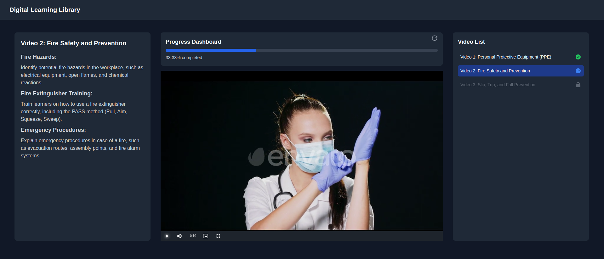

# Digital Learning Library

Digital Learning Library is a full-stack application that provides an interactive training module for employees to watch video content in sequence.

<p align="center">
  
</p>

## Features

- Sequential video playback
- Resume from last stop
- Back navigation to previously watched videos
- Progress tracking
- Responsive design

## Tech Stack

- Frontend: React
- Backend: Node.js, Express
- Database: MongoDB
- Video Player: Video.js

## Prerequisites

- Node.js
- MongoDB

## Project setup

1. Clone this repository using `git clone https://github.com/gnpaone/digital-learning.git`.

2. Set up environment variables:<br>
Create a `.env` file in the root directory of both frontend and backend.
    - Backend:
    ```MONGODB_URI=<your-mongodb-url>```

    - Frontend:
    ```VITE_BE_URL=<your-backend-url>```

3. Install dependencies using `npm install` in both frontend and backend directories.

4. Seed the database in backend directory:
```npm run seed```

5. Start the backend server using `npm start` and run the frontend application using `npm run dev`.

6. Default server port is `5000` and default client port is `5173`. View the application at
```http://localhost:5173```

## Project Structure

- `frontend/`: React frontend application
- `backend/`: Express backend server
- `-controllers/`: Request handlers
- `-models/`: Database models
- `-routes/`: API routes
- `-server.js`: Main server file

## API Endpoints

- GET `/api/videos`: Retrieve all videos
- POST `/api/videos/progress`: Update video progress
